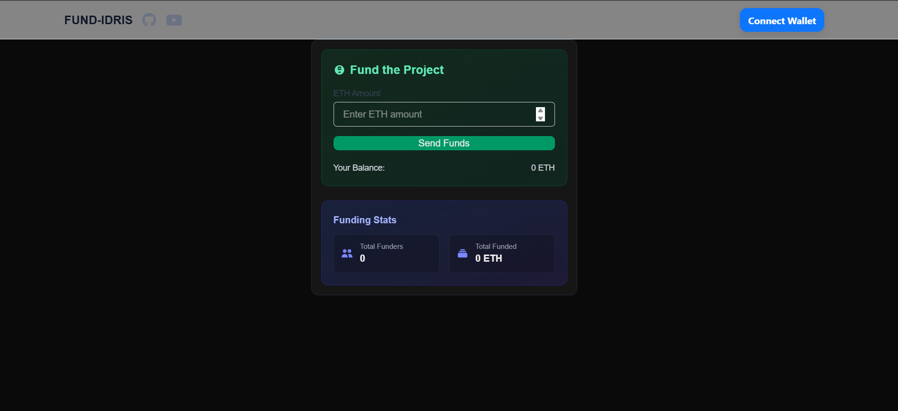

# 💸 FundIdris Smart Contract

A decentralized crowdfunding smart contract built with Solidity and tested using Foundry. FundIdris allows users to contribute ETH to a project while enforcing strict ownership, goal enforcement, and secure withdrawal logic.

---

## 🎥 Introduction

[]([https://www.youtube.com/watch?v](https://www.youtube.com/watch?v=cOxl-miweWI&feature=youtu.be)=YOUR_VIDEO_ID_HERE)

---

## ✨ Features

- ✅ Accepts ETH funding from anyone
- ✅ Tracks contributors and amounts
- ✅ Enforces a minimum funding threshold
- ✅ Owner-only withdrawal of funds
- ✅ Gas-optimized withdrawal (`cheaperWithdraw`)
- ✅ 82.57% unit test coverage with Foundry

---

## 🔧 Built With

| Tech         | Purpose                             |
|--------------|-------------------------------------|
| Solidity     | Smart contract language             |
| Foundry      | Testing, scripting, and deployment  |
| Chainlink    | (Planned) Integration for oracles   |
| Viem / Wagmi | (Frontend Integration)              |

---

## 📜 Contract Overview

### `constructor(uint256 minUsd)`
Initializes the contract with a minimum funding threshold (in USD, using Chainlink price feed if integrated).

### `fund() external payable`
Allows any address to send ETH to the contract if the value exceeds the minimum USD threshold.

### `withdraw() public onlyOwner`
Allows the contract owner to withdraw all funds and reset the state.

### `cheaperWithdraw() public onlyOwner`
Gas-optimized version of `withdraw()` using memory arrays.

### `getOwner() external view returns (address)`
Returns the owner of the contract.


---

## 🧪 Testing

This contract has full unit test coverage using [Foundry](https://book.getfoundry.sh/).

To run tests:

```bash
forge test


To check gas usage:

forge test --gas-report


🔐 Security Considerations
Uses onlyOwner modifier to restrict withdrawals

Proper reentrancy-safe logic in withdrawal patterns

Compliant with modern Solidity style guide

Events and access control implemented

⚠️ This contract is not audited. Use at your own risk.


🌍 Future Improvements
Chainlink price feed integration for dynamic USD-based funding enforcement

Campaign structuring (multiple campaigns, deadlines, etc.)

Frontend DApp integration (in progress)

🙋‍♂️ Author
Obaka Idris
Blockchain Developer | Web3 DApp Engineer

GitHub: @YourGitHubUsername

Twitter: @YourHandle

Portfolio: https://yourportfolio.site

📄 License
MIT License. 


### 🎁 Bonus Suggestions
If you're deploying this to a testnet or mainnet:
- Add the **contract address**
- Mention the **network** it's deployed on
- Link to **Etherscan** or **block explorer**

---


